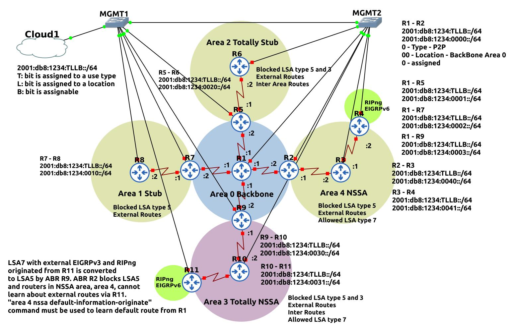
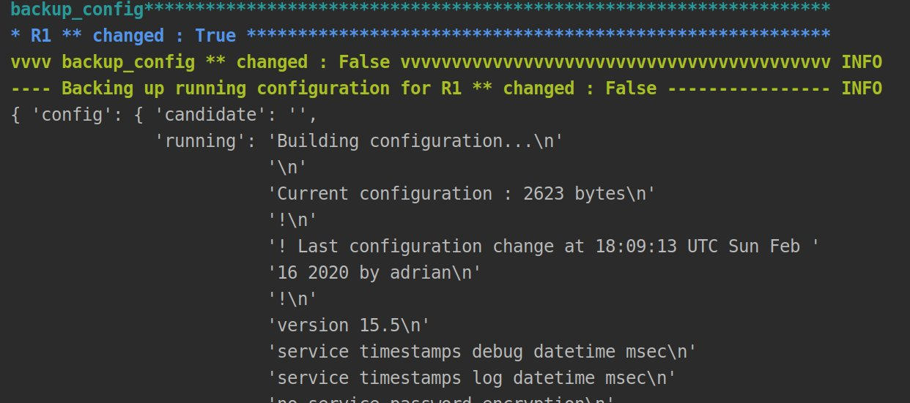
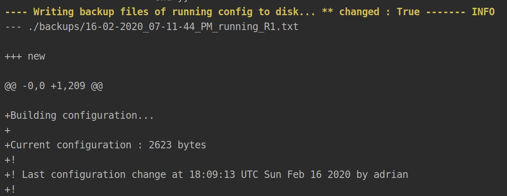
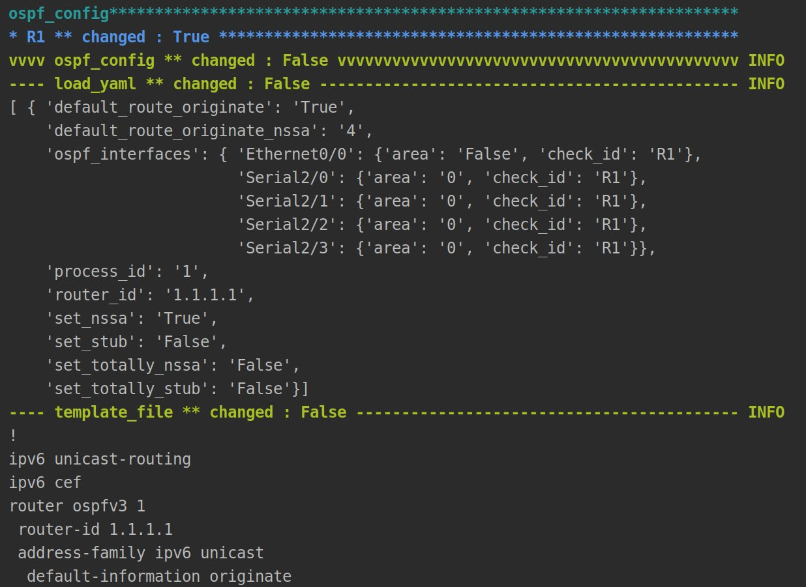
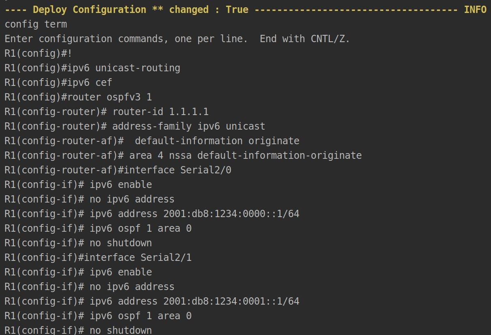

# Automation with Nornir framework
Deploying OSPF configuration on Cisco routers using data stored in yaml files. Nornir is used as automation framework. 

Check Nornir docs: https://nornir.readthedocs.io/en/latest/

Check also https://pynet.twb-tech.com/ for well explained examples. 

This repo contains project created during learning Nornir framework. 
Nornir has great flexibility because of python. Nornir was rewritten in Golang to. More clear then Ansible in my 
opinion and faster task execution for sure.  
Network automation hype can be good motivation to learn python that can be used in many many other projects 
not related to network or systems automation. That is why I liked Nornir more than Ansible. 

Topology: 

Nornir output fragments for one device: 

Yaml data structure can be for sure more optimized. 